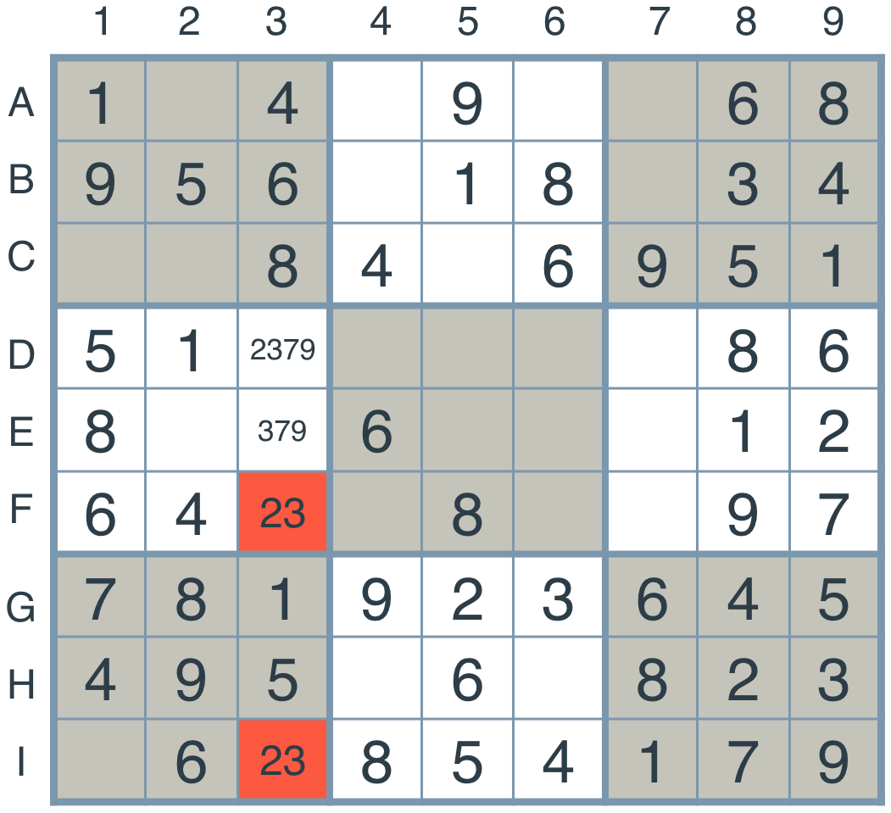

# Artificial Intelligence Nanodegree
## Introductory Project: Diagonal Sudoku Solver

# Question 1 (Naked Twins)
How do we use constraint propagation to solve the naked twins problem?  
Constraint propagation is a method for reducing the search space by applying constraints and reducing the number of possibilities.
The basic idea of constraint propagation is to detect and remove variables that are no longer required to be included, by repeated analysis and evaluation of the constraints.

In the Naked Twins problem, we evaluate each unit repeatedly to remove numbers from possible values. Unit in this case can be either a row, a column or a grid.Within the unit we look for cells with only two possibilties and check if there are duplicates to it.We can detect digits in the duplicates which cannot be used among other cells in the unit.Like in the example below, '23' which is a duplicate in column 3 and other items in column 3 cannot have 2 or 3 and thus need to be removed.


This kind of constraint propogation in Naked Twins is a perfect way to eliminate possibilities and reduce search space.


# Question 2 (Diagonal Sudoku)
How do we use constraint propagation to solve the diagonal sudoku problem?  
Diagonal sudoku is like a regular sudoku where the numbers 1-9 has to appaear only once along the 2 diagonals.In our solution we add the diagonal units to the peer group and overall units and thereby the strategy we use for "Eliminate" and "Only_Choice" works fine here also.

We device the eliminiate strategy by focusing on the constraint that if a box has a value assigned, then none of the peers of this box can have this value. In this case, peer of a box can be its rows,columns, 3 x 3 grid or other diagonal items.Eliminate strategy can be effectively used for reducing the number of items. 

When there is only one choice for a digit in a box, then that digit must be assigned to that box.This strategy is called "only_choice", which can be applied to all units for eliminating items.

### Install

This project requires **Python 3**.

We recommend students install [Anaconda](https://www.continuum.io/downloads), a pre-packaged Python distribution that contains all of the necessary libraries and software for this project. 
Please try using the environment we provided in the Anaconda lesson of the Nanodegree.

##### Optional: Pygame

Optionally, you can also install pygame if you want to see your visualization. If you've followed our instructions for setting up our conda environment, you should be all set.

If not, please see how to download pygame [here](http://www.pygame.org/download.shtml).

### Code

* `solution.py` - You'll fill this in as part of your solution.
* `solution_test.py` - Do not modify this. You can test your solution by running `python solution_test.py`.
* `PySudoku.py` - Do not modify this. This is code for visualizing your solution.
* `visualize.py` - Do not modify this. This is code for visualizing your solution.

### Visualizing

To visualize your solution, please only assign values to the values_dict using the ```assign_values``` function provided in solution.py

### Submission
Before submitting your solution to a reviewer, you are required to submit your project to Udacity's Project Assistant, which will provide some initial feedback.  

The setup is simple.  If you have not installed the client tool already, then you may do so with the command `pip install udacity-pa`.  

To submit your code to the project assistant, run `udacity submit` from within the top-level directory of this project.  You will be prompted for a username and password.  If you login using google or facebook, visit [this link](https://project-assistant.udacity.com/auth_tokens/jwt_login for alternate login instructions.

This process will create a zipfile in your top-level directory named sudoku-<id>.zip.  This is the file that you should submit to the Udacity reviews system.

